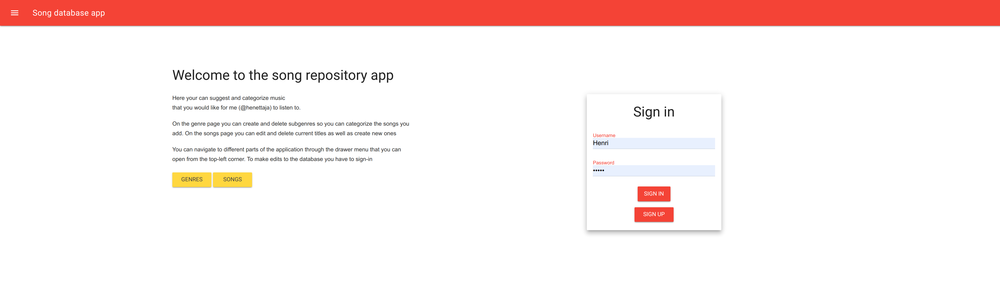
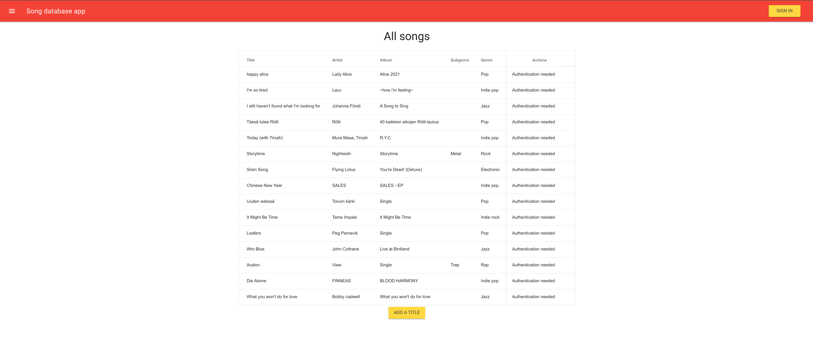

# Songdb
### Server programming course final-assignment Spring Boot application

This is a backend song database application written in Java with Spring Boot and Thymeleaf.

Try it out: [Music database app](https://musicdbapp.herokuapp.com/index)

##### Features:
* Multiple users
* Different user roles have different views and features.
* Forces sign-in to add new data to the database
* Anyone can look at the data (except user data which is only viewable as an admin)

Feel free to suggest some music for me to listen to! :D

### Screenshots

